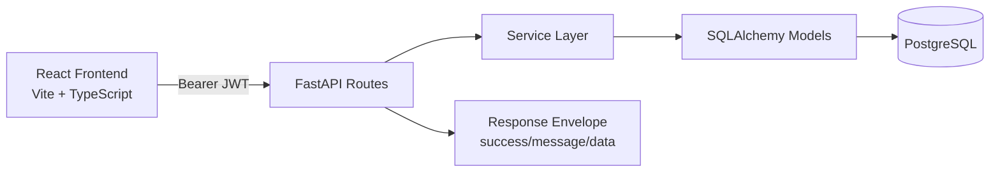

# Task & Team Management System

A full-stack SaaS project (mini Trello / simplified Jira) for managing teams, projects, tasks, ownership, and delivery insights.

## Project Overview
This app provides a complete workflow for:
- JWT authentication and protected routes
- Team creation and member invitations
- Project CRUD within team scope
- Task board with status flow and assignment
- My Tasks dashboard with analytics and overdue highlighting
- Role-aware permissions (owner/member + restricted actions)

## Tech Stack
- Backend: FastAPI, SQLAlchemy, Alembic, PostgreSQL
- Frontend: React + TypeScript + Vite
- Auth: JWT Bearer Token
- Styling: Custom responsive CSS design system

## Main Features
- Authentication:
  - Register/login with JWT
  - `/auth/me` profile endpoint
  - Protected backend endpoints
- Teams:
  - Create teams
  - Invite existing users by username/email
  - View members and role badges (Owner/Member)
- Projects:
  - Create, list, edit projects by team
  - Delete restricted to project owner
- Tasks:
  - Create tasks with title, description, due date, status, assignee
  - Kanban-style board (`todo` / `in-progress` / `done`)
  - Status updates (assigned user only)
  - Assignment updates (owner-level permissions)
  - Filters by project/status/assignee
- Dashboard:
  - My assigned tasks list
  - Status counts and project totals
  - Donut + bar visualization
  - Overdue highlighting and loading skeletons

## Architecture


## Local Setup
### 1. Backend
```bash
cd backend
python3 -m venv .venv
source .venv/bin/activate
pip install -r requirements.txt
cp .env.example .env
alembic upgrade head
uvicorn app.main:app --reload
```

### 2. Frontend
```bash
cd frontend/task-managment
npm install
cp .env.example .env
npm run dev
```

Frontend default: `http://localhost:5173`  
Backend default: `http://localhost:8000`

## Environment Variables
### Backend (`backend/.env`)
- `DATABASE_URL`
- `SECRET_KEY`
- `ALGORITHM` (default: `HS256`)
- `ACCESS_TOKEN_EXPIRE_MINUTES` (default: `60`)
- `FRONTEND_ORIGINS` (comma-separated)

### Frontend (`frontend/task-managment/.env`)
- `VITE_API_URL` (example: `http://localhost:8000`)

## Deployment
### Backend (Render/Railway/Heroku)
1. Create managed PostgreSQL.
2. Set backend env vars.
3. Run migrations on deploy: `alembic upgrade head`.
4. Start command:
```bash
uvicorn app.main:app --host 0.0.0.0 --port $PORT
```

### Frontend (Vercel/Netlify)
1. Set `VITE_API_URL` to production backend URL.
2. Build command: `npm run build`
3. Output directory: `dist`

## Screenshots & Demo
Place portfolio assets here:
- `docs/screenshots/dashboard.png`
- `docs/screenshots/task-board.png`
- `docs/screenshots/team-management.png`
- `docs/demo.gif`

## Professional Practices Used
- Service-oriented backend architecture
- Consistent request/response schemas
- Standardized API envelope and centralized error handling
- Permission checks enforced in backend and reflected in UI
- Reusable frontend components (Button/Card/FormInput/Modal/Sidebar/Navbar)
- Global auth/workspace context for shared state
- Confirmation modals for destructive actions
- Loading states and explicit error messaging

## What I Learned
- How to implement vertical slice development in SaaS features
- How backend authorization design influences frontend UX
- How reusable UI primitives speed up product-level iteration
- How to keep API contracts stable during refactors
